<!--
  README do perfil. Procure por ✏️ para achar o que você precisa editar.
  As imagens stats.svg, top-langs.svg e snake-*.svg NÃO precisam ser criadas à mão:
  o workflow em .github/workflows/atualizar-perfil.yml gera e atualiza todo dia.
-->

&nbsp;

## Sobre mim

Sou dev e hoje meu principal projeto é a **SARAH**, uma assistente pessoal de IA com voz que roda no meu Mac. Logo abaixo tem um resumo do que ela já faz.

<!-- ✏️ Vale uma segunda frase dizendo o que você busca: estágio, primeira vaga, freelas, projetos open source... -->

## Stack

<!-- SQL não tem ícone genérico: usei o do SQLite (troque por postgres ou mysql se preferir) -->

## Projeto em destaque

### SARAH

Assistente pessoal de IA para macOS, inspirada no JARVIS. Ela entende comandos de voz em português e inglês e age nos apps que eu uso todo dia.

- **Voz:** acorda com "SARAH" ou duas palmas e pode ser interrompida no meio da fala. A interface é um painel estilo HUD com uma esfera holográfica que reage enquanto ela pensa.
- **Integrações:** Notion Calendar, Calendário, Lembretes e Notas da Apple, Gmail e chamadas de vídeo pelo FaceTime.
- **Agente de código:** cria projetos e sites numa pasta isolada, com repositório no GitHub, commits e pull requests.
- **Segurança:** cada ferramenta tem um nível de risco. Enviar e-mail, dar push ou apagar algo só acontece depois de uma confirmação, e tudo fica registrado num log de auditoria.
- **Memória:** guarda preferências entre sessões e busca por significado, não só por palavra-chave.

**Feito com:** TypeScript, Electron, Node.js, SQLite e Claude Agent SDK.

<!-- ✏️ Grave um GIF curto (5 a 10 s) da SARAH respondendo, salve como profile/sarah.gif
     e tire o comentário da linha abaixo. Uma imagem em movimento vende o projeto melhor que qualquer texto. -->
<!--  -->

## Atividade

&nbsp;

<picture>
  <source media="(prefers-color-scheme: dark)" srcset="./profile/snake-dark.svg" />
  <source media="(prefers-color-scheme: light)" srcset="./profile/snake-light.svg" />
  
</picture>
